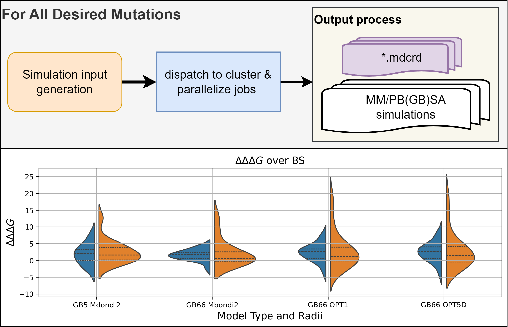

# <p style="text-align: center;">High Throuput Mutational Scanning In Amber </p>

This documentation section is dedicated to illustrating the High Throughput Mutational Scanning (HTMS) pipeline, designed for efficient use within the Amber molecular dynamics environment. Here, we will guide you through the practical aspects of implementing HTMS-Amber. We'll cover the essential setup and execution steps for both standard Alanine Scanning and the more involved Non-Alanine Mutations. While this section focuses on providing a quick start with functional examples, for more details, please consult the detailed documentation and the source code.


<p style="text-align: center;">A General Overview of the pipeline with its potential applications for high-throughput calculations of changes in binding free energies of multiple mutations</p>

## Overview of Alanine Scanning

### Without *mcdrd files
Prior to deploying the pipeline, as done below, the user should make use of the `run_simulation_gpu.sh` script. The user is free to customize their input files (*.in) as presented in the AMBER manual.

Note: The provided `tmp_input_file.txt` assumes all `*.mcdrd` files are located in the same folder as the `htms_pipeline.py` call.

### With *mcdrd files

To run the Alanine Scanning pipeline edit the tmp_input_file.txt according your desired specifications. In this example we will be looking at 3 mutations: T:470:A E:471:A I:472:A

For the purposes of demonstrating the workflow we are calling htms_pipeline.py from the example direcotry. Moreover, we are making use of the --just_build option to not actully run our mmpbsa.py calls. This is done to showcase the standard output format.

`HTMS_Amber\examples$ python ..\HTMS_Amber\htms_pipeline.py --input_file .\tmp_input_file.txt --just_build --test`

Simply call the script as below to delpoy the pipeline properly:

`HTMS_Amber\examples$ python ..\HTMS_Amber\htms_pipeline.py --input_file .\tmp_input_file.txt`

We note `mmpbsa.in` in placed within the directory the pipeline is deployed from and shared amoung all runs.


## Overview of Non-Alanine Mutations

In order to handle non-Alanine mutations we opt to incorporate a call to MODELLER for mutated pdb file generation.

`HTMS_Amber\examples$ python ..\HTMS_Amber\htms_pipeline.py --input_file .\non_ala_tmp_input_file.txt --just_build --test --non_ala`

We note the current implementation of the non_alanine scanning pipeline will require the user to first run production runs, then mmpbsa. Given this we opt to dispatch these separetley so we can make use of GPU production, and then scale back to minimal cpu and memory requirements for the mmpbsa.py portion

Sample output files from this call are present in the exmaples folder under _E417N, _E484K_N501Y

## Further Documentation and Examples 

```{toctree}
:maxdepth: 2
:caption: Contents:

examples
modules